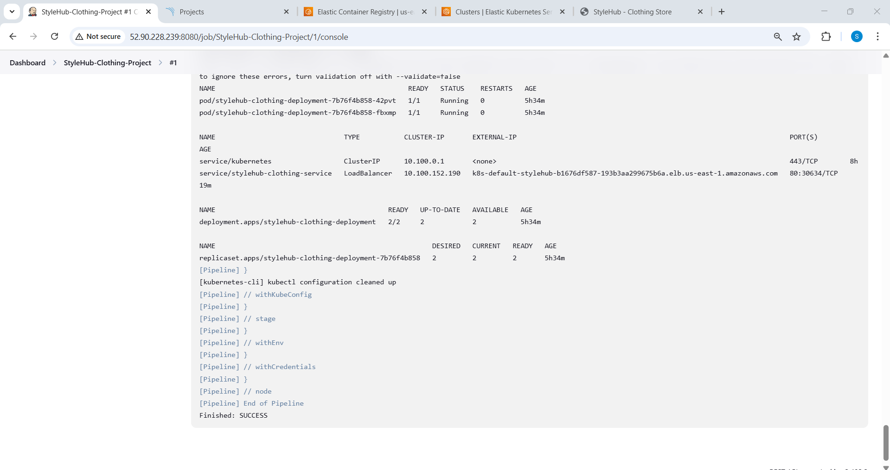
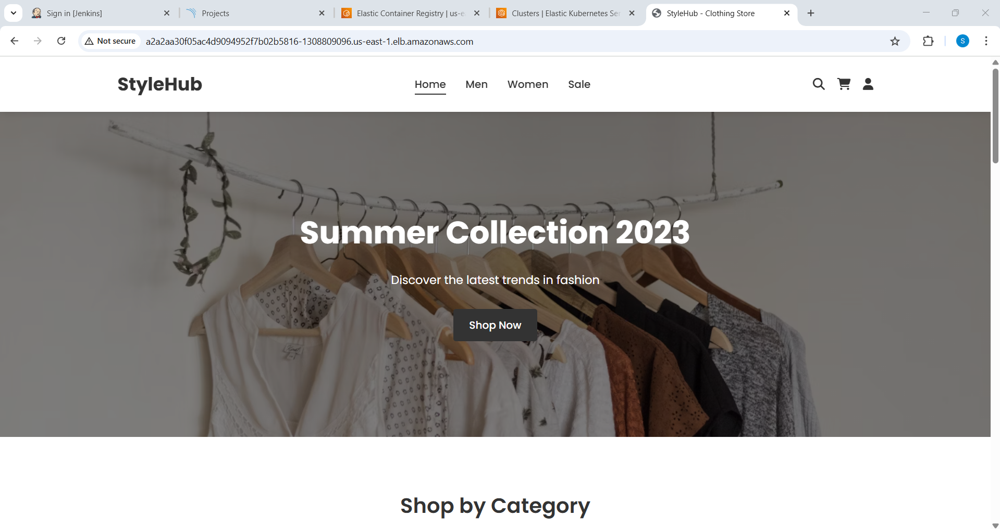
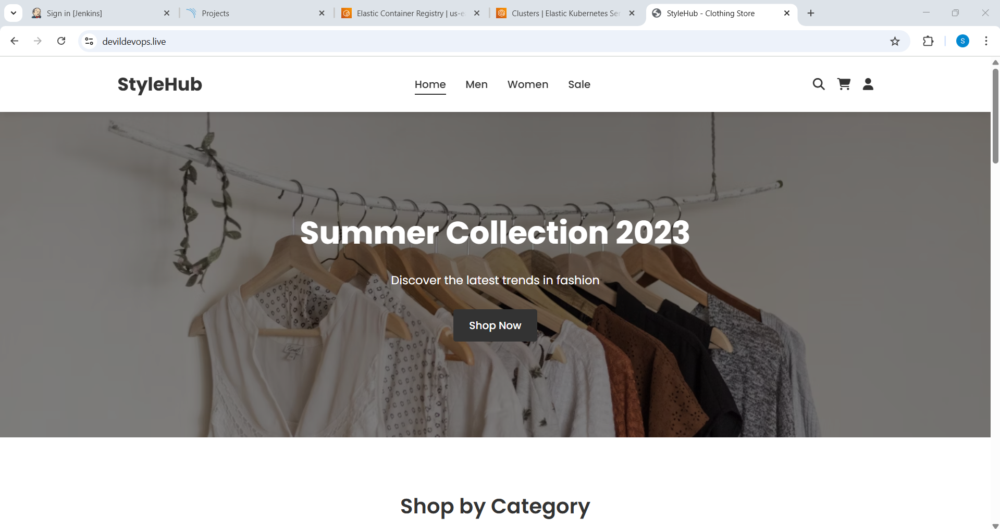

# EKS-DevSecOps-Pipeline


## Project Overview


This project demonstrates a **DevSecOps pipeline** to deploy an application on an **EKS cluster** with security and automation best practices. The pipeline leverages:

- **Jenkins** for Continuous Integration and Deployment (CI/CD)
- **SonarQube** for static code analysis
- **Trivy** for vulnerability scanning
- **Amazon ECR** for storing Docker images
- **EKS** for containerized application deployment
- **Helm** for package management
- **Prometheus & Grafana** for monitoring

---

## **Architecture Overview**

- Source Code Management (GitHub/GitLab)
- Jenkins orchestrates the CI/CD pipeline
- SonarQube ensures code quality
- Trivy scans for vulnerabilities
- Docker images are pushed to Amazon ECR
- EKS deploys the application
- ALB Ingress is used for external access
- Prometheus & Grafana enable real-time monitoring

---

## **Step 1: Install Jenkins and SonarQube using Terraform**

The infrastructure code is available in the **`/infra`** directory.


### **Prerequisites for Jenkins Server**

#### **Install AWS CLI**

```sh
sudo apt update
sudo apt install unzip curl -y
curl "https://awscli.amazonaws.com/awscli-exe-linux-x86_64.zip" -o "awscliv2.zip"
unzip awscliv2.zip
sudo ./aws/install
```

#### **Install Docker**

```sh
sudo apt update -y
sudo apt install docker.io -y
sudo usermod -aG docker jenkins
sudo systemctl restart docker
sudo systemctl restart jenkins
```

#### **Install Node.js**

```sh
sudo apt update -y
curl -fsSL https://deb.nodesource.com/setup_18.x | sudo -E bash -
sudo apt install -y nodejs
```

#### **Install SonarScanner**

```sh
wget https://binaries.sonarsource.com/Distribution/sonar-scanner-cli/sonar-scanner-cli-5.0.1.3006-linux.zip
unzip sonar-scanner-cli-5.0.1.3006-linux.zip -d /opt
mv /opt/sonar-scanner-* /opt/sonar-scanner
echo 'export PATH=$PATH:/opt/sonar-scanner/bin' >> ~/.bashrc
source ~/.bashrc
sonar-scanner --version
```

#### **Install Trivy for Vulnerability Scanning**

```sh
sudo apt-get install -y wget apt-transport-https gnupg lsb-release
wget -qO - https://aquasecurity.github.io/trivy-repo/deb/public.key | sudo apt-key add -
echo "deb https://aquasecurity.github.io/trivy-repo/deb $(lsb_release -sc) main" | sudo tee -a /etc/apt/sources.list.d/trivy.list
sudo apt-get update && sudo apt-get install -y trivy
```

---

## **Step 2: Create Amazon ECR Registry**

Create an ECR registry to store the Docker images.

```sh
aws ecr create-repository --repository-name my-app-repo --region us-east-1
```


---

## **Step 3: Create EKS Cluster using Terraform**

Alternatively, you can create it manually using a bootstrap server.

### **Install AWS CLI**

```sh
curl "https://awscli.amazonaws.com/awscli-exe-linux-x86_64.zip" -o "awscliv2.zip"
unzip awscliv2.zip
sudo ./aws/install
```

### **Install Kubectl**

```sh
curl -O https://s3.us-west-2.amazonaws.com/amazon-eks/1.26.4/2023-05-11/bin/linux/amd64/kubectl
chmod +x kubectl
mv kubectl /usr/local/bin/
kubectl version
```

### **Install Eksctl**

```sh
curl --silent --location "https://github.com/weaveworks/eksctl/releases/latest/download/eksctl_$(uname -s)_amd64.tar.gz" | tar xz -C /tmp
sudo mv /tmp/eksctl /usr/local/bin
eksctl version
```

### **Attach IAM Role**

Create a role named **"eksctl\role"** and attach it to eks_bootstrap_server.

### **Create an EKS Cluster**

```sh
eksctl create cluster --name my-eks-cluster --region us-east-1 --node-type t2.medium --nodes 2
```


### **Install Helm**

```sh
curl -fsSL -o get_helm.sh https://raw.githubusercontent.com/helm/helm/main/scripts/get-helm-3
chmod 700 get_helm.sh
./get_helm.sh
```

### **Install AWS Load Balancer Controller using Helm**

Note : 
1) Attach role to worker nodes with EC2 and ELB access
2) Update ingress.yaml with ACM Certificate ARN

```sh
helm repo add eks https://aws.github.io/eks-charts
helm repo update
helm install aws-load-balancer-controller eks/aws-load-balancer-controller \
    --set clusterName=<your-cluster-name> \
    --set serviceAccount.create=true \
    --set serviceAccount.name=aws-load-balancer-controller \
    --namespace kube-system
kubectl get pods -n kube-system | grep aws-load-balancer-controller
```
---

## **Step 4: Install Jenkins Plugins**

- Git
- SonarQube Scanner
- Quality Gates
- Trivy
- Docker Pipeline
- Amazon ECR Plugin
- AWS Credentials
- Kubernetes CLI

---

## **Step 5: Configure Jenkins Credentials**

1. **SonarQube Token** – Add to **Jenkins Global Credentials** as **Secret Text**.


2. **AWS Access & Secret Key** – Add using **AWS Credentials Plugin**.
3. **ECR URL** – Store as **Secret Text**.
4. **Kubeconfig** – Upload Jenkins server's kubeconfig file.


---

## **Step 6: Create Jenkins Pipeline Job**

1. **Assign Git Repository**
2. **Specify Jenkinsfile Path**
3. **Apply and Save**
4. **Click on 'Build Now'**


---

## **Step 7: Verify the Pipeline Execution**

- ✅ **Git Clone**
- ✅ **SonarQube Analysis & Quality Gate**


- ✅ **Trivy Image Vulnerability Scan**


- ✅ **Docker Build & Push to ECR**


- ✅ **Deploy Kubernetes Manifest to EKS**



- ✅ **Check ALB Creation**
- ✅ **Access Application via Load Balancer URL**



- ✅ **Pipeline Overview**


---

## **Step 8: Monitoring Setup with Prometheus & Grafana**

```sh
helm repo add prometheus-community https://prometheus-community.github.io/helm-charts
helm repo update
kubectl create namespace monitoring
helm install prometheus-stack prometheus-community/kube-prometheus-stack --namespace monitoring
kubectl get pods -n monitoring
kubectl port-forward svc/prometheus-stack-kube-prom-prometheus 9090:9090 -n monitoring
kubectl port-forward svc/prometheus-stack-grafana 3000:80 -n monitoring
```

Grafana UI will be available at `http://localhost:3000`.


---

## **Step 9: Configure Route 53 DNS**

- Create an **A Record** with **Alias** pointing to **ALB Ingress**.


- Access the application using `https://devildevops.live`.



> **Note:** DNS changes may take a few hours to propagate.

---

## **Project Summary**

This project provides a **secure, automated, and scalable** DevSecOps solution for deploying applications on an **AWS EKS cluster**. It ensures security using **Trivy**, maintains code quality with **SonarQube**, automates CI/CD using **Jenkins**, and monitors performance using **Prometheus & Grafana**.

**🚀 Ready to use! Fork, Clone, and Deploy!**

